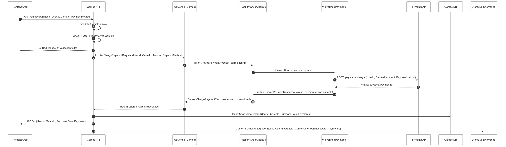

# TC Cloud Games - Payments Service

A robust and scalable payment processing microservice built with .NET 9, designed to handle financial transactions, payment approvals, and integration with external payment providers in a cloud-native gaming platform.

## 🏗️ Architecture Overview

The Payments service follows hexagonal architecture (ports & adapters) with clear separation of concerns and implements event-driven patterns for reliable payment processing.

```
payments/
├── 📁 src/
│   ├── 🔌 Adapters/
│   │   ├── Inbound/
│   │   │   └── TC.CloudGames.Payments.Api/     # HTTP API endpoints
│   │   └── Outbound/
│   │       └── TC.CloudGames.Payments.Infrastructure/  # Data persistence & external integrations
│   └── 🎯 Core/
│       ├── TC.CloudGames.Payments.Domain/      # Business logic & aggregates
│       └── TC.CloudGames.Payments.Application/ # Use cases & message handlers
├── 📁 test/
│   └── TC.CloudGames.Payments.Unit.Tests/      # Unit testing
└── 📁 docs/
    └── images/
        └── payment_workflow.png                 # Payment flow diagram
```

## 💳 Payment Workflow

The Payments service orchestrates a comprehensive payment flow that ensures reliable transaction processing and seamless integration with the Games service:

<div align="center">
  <a href="./docs/images/payment_workflow.png" target="_blank" title="Click to view full-size payment workflow diagram">
    
  </a>
  <br>
  <em>🔍 Click to view full-size payment workflow diagram</em>
</div>

### Payment Process Flow
1. **Game Purchase Request**: Games service initiates a purchase request
2. **Payment Processing**: Payments service validates and processes the transaction
3. **Payment Approval**: External payment provider approves/rejects the payment
4. **Status Update**: Payment status is updated and communicated back to Games service
5. **Email Notification**: Confirmation email is sent to the user

## 🎯 Key Features

### Payment Processing
- **Transaction Management**: Secure handling of financial transactions
- **Payment Validation**: Comprehensive validation of payment requests
- **External Integration**: Seamless integration with payment gateways
- **Status Tracking**: Real-time payment status monitoring

### Event-Driven Architecture
- **Message Broker Communication**: Asynchronous communication via Azure Service Bus/RabbitMQ
- **Event Sourcing**: Complete audit trail of payment events
- **Outbox Pattern**: Ensures reliable message delivery
- **Domain Events**: Rich domain event model for business logic

### Reliability & Security
- **Transaction Consistency**: ACID compliance with Marten/PostgreSQL
- **Error Handling**: Comprehensive error management and recovery
- **Retry Mechanisms**: Built-in retry logic for failed operations
- **Audit Trail**: Complete payment history and compliance tracking

## 🔧 Technology Stack

### Backend Framework
- **.NET 9**: Modern, high-performance framework with latest C# features


### Event Sourcing & Messaging
- **Marten**: Event Store and Document Database for PostgreSQL
- **Wolverine**: Advanced message broker with built-in CQRS support
- **PostgreSQL**: Primary database with dedicated payment schema
- **Azure Service Bus**: Production message broker for reliable communication
- **RabbitMQ**: Local development messaging infrastructure

### Infrastructure & DevOps
- **Docker**: Containerization for consistent deployment
- **Health Checks**: Comprehensive health monitoring
- **OpenTelemetry**: Distributed tracing and metrics collection
- **Serilog**: Structured logging with Grafana Loki integration

### Observability & Monitoring
- **Prometheus**: Metrics collection and monitoring
- **Grafana Loki**: Centralized log aggregation
- **Health Check UI**: Real-time service health dashboard

## 🏛️ Architecture Patterns

### Hexagonal Architecture
- **Domain Layer**: Core payment business logic and aggregates
- **Application Layer**: Payment use cases, commands, and message handlers
- **Infrastructure Layer**: Database, messaging, and external service integrations
- **API Layer**: HTTP endpoints and request/response handling

### Event Sourcing
- **Payment Aggregate**: Core business entity with event-driven state management
- **Domain Events**: PaymentStatusUpdateDomainEvent for state changes
- **Event Store**: Marten-based event persistence for complete audit trail
- **Projections**: Optimized read models for payment queries

### Message Broker Integration
- **Integration Events**: Cross-service communication via structured events
- **Outbox Pattern**: Transactional outbox ensures message delivery consistency
- **Event Handlers**: Wolverine-based handlers for incoming payment requests
- **Dead Letter Queues**: Error handling and message recovery mechanisms

## 📦 Core Components

### Payment Aggregate
```csharp
// Simplified representation
public class PaymentAggregate : BaseAggregateRoot
{
    public Guid UserId { get; set; }
    public Guid GameId { get; set; }
    public decimal Amount { get; set; }
    public bool IsApproved { get; set; }
    public string? ErrorMessage { get; set; }
    public DateTimeOffset PurchaseDate { get; set; }
}
```

### Message Handler
- **GamePurchasedRequestHandler**: Processes incoming purchase requests from Games service
- **Payment Validation**: Validates payment requests and business rules
- **Status Updates**: Publishes payment status back to Games service
- **Error Handling**: Manages payment failures and retry logic

### Integration Events
- **GamePurchasedIntegrationEvent**: Incoming purchase request from Games service
- **GamePaymentStatusUpdateIntegrationEvent**: Outgoing payment status to Games service

## 🚀 Getting Started

### Prerequisites
- [.NET 9 SDK](https://dotnet.microsoft.com/download)
- [Docker Desktop](https://www.docker.com/products/docker-desktop)
- [PostgreSQL](https://www.postgresql.org/) (or Docker container)
- [RabbitMQ](https://www.rabbitmq.com/) (for local development)

### Local Development

1. **Clone the repository**
```bash
git clone https://github.com/rdpresser/tc-cloudgames-payments.git
cd tc-cloudgames-payments
```

2. **Configure connection strings**
```bash
# Update appsettings.Development.json with your connection strings
```

3. **Run the application**
```bash
cd src/Adapters/Inbound/TC.CloudGames.Payments.Api
dotnet run
```

4. **Access the API**
- Health Checks: `https://localhost:7001/health`


## 🔄 Message Flow

### Incoming Events
- **GamePurchasedIntegrationEvent**: Triggered when a user purchases a game
  - Contains: UserId, GameId, PaymentId, Amount, GameName
  - Processed by: GamePurchasedRequestHandler

### Outgoing Events
- **GamePaymentStatusUpdateIntegrationEvent**: Payment processing result
  - Contains: PaymentId, Status, Success, ErrorMessage
  - Consumed by: Games service for library updates

## 🧪 Testing

### Unit Tests
```bash
# Run unit tests
dotnet test test/TC.CloudGames.Payments.Unit.Tests/
```

## 📊 Monitoring & Health Checks

### Health Endpoints
- `/health`: Basic health check

### Metrics & Observability
- **OpenTelemetry**: Distributed tracing across payment operations
- **Prometheus**: Custom payment metrics and performance indicators
- **Serilog**: Structured logging with correlation IDs
- **Application Insights**: Production monitoring and alerting

## 🚀 Deployment

### Local Development
Use .NET Aspire AppHost for local orchestration with all dependencies.

### Azure Container Apps
Production deployment on Azure with:
- Container Apps for auto-scaling
- Azure Service Bus for messaging
- Azure Database for PostgreSQL
- Application Insights for monitoring

## 📄 License

This project is licensed under the MIT License - see the [LICENSE](LICENSE) file for details.

## 📞 Support

For questions or issues:
- Open an [issue](https://github.com/rdpresser/tc-cloudgames-payments/issues)
- Check the [documentation](./docs/)
- Review the payment workflow diagram

---

**TC Cloud Games Payments** - Secure, scalable payment processing for modern cloud gaming platforms.