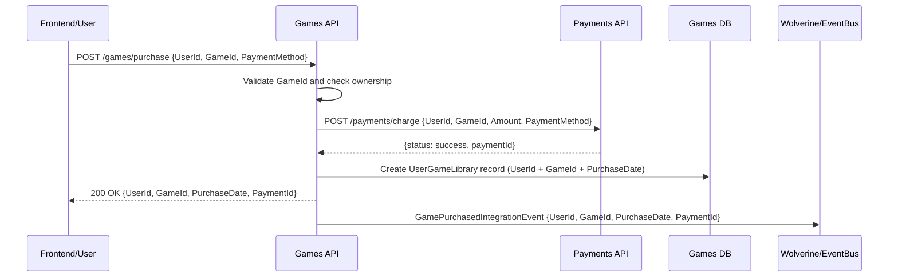

# 💳 TC Cloud Games - Payments Service

The Payments microservice is responsible for processing financial transactions, managing payment workflows, and integrating with external payment gateways for the TC Cloud Games platform. It handles game purchases, refunds, and maintains complete audit trails of all financial operations.

## 🏗️ Architecture Overview

This service follows **Hexagonal Architecture (Ports & Adapters)** with **Domain-Driven Design (DDD)** and **Event-Driven Architecture**:

````
TC.CloudGames.Payments/
├── 🎯 Core/ # Business Logic
│ ├── Domain/ # Domain Layer
│ │ └── Aggregates/ # PaymentAggregate
│ └── Application/ # Application Layer
│ ├── MessageBrokerHandlers/ # Event Handlers
│ ├── Ports/ # Application Interfaces
│ └── Mappers/ # Integration Event Mappers
├── 🔌 Adapters/ # Infrastructure & API
│ ├── Inbound/ # API Layer
│ │ └── TC.CloudGames.Payments.Api/ # REST API Endpoints
│ └── Outbound/ # Infrastructure Layer
│ └── TC.CloudGames.Payments.Infrastructure/ # Database & Repositories
└── 🧪 test/ # Test Suite (Planned)
└── TC.CloudGames.Payments.Unit.Tests/
````

## 🎯 Domain Model

### Core Aggregate

#### 💳 PaymentAggregate
The main aggregate representing a payment transaction with Event Sourcing:

```csharp
public class PaymentAggregate : BaseAggregateRoot
{
    public Guid UserId { get; set; }
    public Guid GameId { get; set; }
    public string GameName { get; set; } = string.Empty;
    public decimal Amount { get; set; }
    public bool IsApproved { get; set; }
    public string? ErrorMessage { get; set; }
    public DateTimeOffset PurchaseDate { get; set; }
}
```

**Key Features:**
- **Event Sourcing**: Complete audit trail of payment status changes
- **Transaction Tracking**: User, game, and amount tracking
- **Status Management**: Approved/failed payment states
- **Error Handling**: Detailed error message capture
- **Integration Ready**: Designed for external payment gateway integration

### Domain Events

#### PaymentStatusUpdateDomainEvent
```csharp
public record PaymentStatusUpdateDomainEvent(
    Guid AggregateId,
    Guid UserId,
    Guid GameId,
    string GameName,
    decimal Amount,
    bool Success,
    string? ErrorMessage,
    DateTimeOffset OccurredOn = default
) : BaseDomainEvent(AggregateId, OccurredOn);
```

## 🔧 Technology Stack

### Backend Framework
- **.NET 9**: Modern, high-performance framework
- **FastEndpoints**: Minimalist, high-performance API endpoints
- **FluentValidation**: Comprehensive input validation

### Data & Storage
- **Marten**: Event Store and Document Database for PostgreSQL
- **PostgreSQL**: Primary database with Event Sourcing support
- **Redis**: Caching and session management

### Messaging & Communication
- **Wolverine**: Message broker with built-in CQRS support
- **Azure Service Bus**: Cloud messaging for production
- **RabbitMQ**: Local development messaging

### Financial Integration
- **Payment Gateways**: Stripe, PayPal, Azure Payment Services
- **PCI Compliance**: Secure payment data handling
- **Fraud Detection**: Integration with fraud prevention services

### Observability
- **Serilog**: Structured logging framework
- **Grafana Loki**: Log aggregation and querying
- **Application Insights**: Application performance monitoring
- **Health Checks**: Service health monitoring

## 🚀 API Endpoints

### Payment Processing

#### Process Payment
```http
POST /api/payments/process
Authorization: Bearer {token}
Content-Type: application/json

{
  "userId": "123e4567-e89b-12d3-a456-426614174000",
  "gameId": "987fcdeb-51a2-43d1-b789-123456789abc",
  "gameName": "Cyberpunk 2077",
  "amount": 59.99,
  "paymentMethod": "credit_card",
  "paymentDetails": {
    "cardNumber": "****1234",
    "expiryMonth": 12,
    "expiryYear": 2025,
    "cvv": "***"
  },
  "billingAddress": {
    "street": "123 Main St",
    "city": "New York",
    "state": "NY",
    "zipCode": "10001",
    "country": "US"
  }
}
```

**Response:**
```json
{
  "paymentId": "456e7890-e89b-12d3-a456-426614174001",
  "status": "approved",
  "transactionId": "txn_123456789",
  "amount": 59.99,
  "processedAt": "2024-01-15T10:30:00Z",
  "gatewayResponse": {
    "gatewayTransactionId": "gw_abc123",
    "gatewayStatus": "success",
    "gatewayMessage": "Payment processed successfully"
  }
}
```

#### Get Payment Status
```http
GET /api/payments/{paymentId}/status
Authorization: Bearer {token}
```

**Response:**
```json
{
  "paymentId": "456e7890-e89b-12d3-a456-426614174001",
  "status": "approved",
  "amount": 59.99,
  "userId": "123e4567-e89b-12d3-a456-426614174000",
  "gameId": "987fcdeb-51a2-43d1-b789-123456789abc",
  "gameName": "Cyberpunk 2077",
  "processedAt": "2024-01-15T10:30:00Z",
  "errorMessage": null
}
```

#### Get User Payment History
```http
GET /api/payments/user/{userId}?page=1&size=20&status=approved
Authorization: Bearer {token}
```

### Refund Management

#### Process Refund
```http
POST /api/payments/{paymentId}/refund
Authorization: Bearer {token}
Content-Type: application/json

{
  "reason": "User requested refund",
  "amount": 59.99,
  "refundType": "full"
}
```

#### Get Refund Status
```http
GET /api/payments/{paymentId}/refunds
Authorization: Bearer {token}
```

## 🏛️ Event-Driven Architecture

### Message Handlers

#### GamePurchasedRequestHandler
Handles game purchase requests from the Games service:

```csharp
public class GamePurchasedRequestHandler
{
    public async Task HandleAsync(
        EventContext<GamePurchasedIntegrationEvent> @event, 
        CancellationToken cancellationToken = default)
    {
        // 1. Map event to domain aggregate
        var aggregate = MapEventToAggregate(@event, isApproved: true, errorMessage: null);

        // 2. Persist domain aggregate 
        await _paymentRepository.SaveAsync(aggregate, cancellationToken);

        // 3. Publish payment integration event to game api
        await PublishIntegrationEventsAsync(aggregate, @event);

        // 4. Commit transaction with outbox pattern
        await _paymentRepository.CommitAsync(aggregate, cancellationToken);
    }
}
```

### Integration Events

#### Incoming Events
- **GamePurchasedIntegrationEvent**: Triggered when user purchases a game
- **RefundRequestedIntegrationEvent**: Triggered when refund is requested

#### Outgoing Events
- **PaymentProcessedIntegrationEvent**: Payment successfully processed
- **PaymentFailedIntegrationEvent**: Payment processing failed
- **RefundProcessedIntegrationEvent**: Refund successfully processed


## 💰 Payment Processing Workflow




### 1. Payment Initiation
- User initiates game purchase
- Games service publishes `GamePurchasedIntegrationEvent`
- Payments service receives event and starts processing

### 2. Payment Processing
- Validate payment details
- Check user balance/credit
- Process payment through gateway
- Handle gateway response

### 3. Payment Completion
- Create PaymentAggregate with status
- Publish integration events
- Update user game library
- Send confirmation notifications

### 4. Error Handling
- Gateway failures
- Insufficient funds
- Invalid payment details
- Network timeouts

## 🔐 Security & Compliance

### PCI DSS Compliance
- **Data Encryption**: All payment data encrypted at rest and in transit
- **Tokenization**: Sensitive payment data tokenized
- **Access Control**: Role-based access to payment data
- **Audit Logging**: Complete audit trail of all operations

### Payment Security
- **Fraud Detection**: Real-time fraud screening
- **Rate Limiting**: API abuse prevention
- **Input Validation**: Comprehensive validation of payment data
- **Secure Storage**: Encrypted storage of payment information

### Data Protection
- **GDPR Compliance**: User data protection
- **Data Retention**: Configurable data retention policies
- **Right to Erasure**: User data deletion capabilities
- **Data Minimization**: Only collect necessary payment data

## 🧪 Testing Strategy

### Unit Tests
- **Domain Logic**: Payment aggregate behavior
- **Event Handlers**: Message processing logic
- **Validation**: Payment data validation
- **Business Rules**: Payment processing rules

### Integration Tests
- **Payment Gateway**: Mock gateway integration
- **Database**: Event sourcing and projections
- **Messaging**: Event publishing and handling
- **API**: End-to-end payment processing

### Contract Tests
- **Payment Gateway**: Gateway API contracts
- **Integration Events**: Event schema validation
- **External Services**: Service integration contracts

### Security Tests
- **Penetration Testing**: Security vulnerability assessment
- **Data Encryption**: Encryption/decryption testing
- **Access Control**: Authorization testing
- **PCI Compliance**: Compliance validation

## 🚀 Local Development

### Prerequisites
- .NET 9 SDK
- Docker Desktop
- PostgreSQL (or use Docker)
- Redis (or use Docker)
- Payment Gateway Test Account

### Setup

```bash
# Clone and navigate to the payments service
cd services/payments

# Restore dependencies
dotnet restore

# Run the service
cd src/Adapters/Inbound/TC.CloudGames.Payments.Api
dotnet run
```

### Environment Configuration

#### Development
```json
{
  "ConnectionStrings": {
    "DefaultConnection": "Host=localhost;Database=payments_db;Username=postgres;Password=password"
  },
  "Redis": {
    "ConnectionString": "localhost:6379"
  },
  "PaymentGateway": {
    "Provider": "Stripe",
    "ApiKey": "sk_test_...",
    "WebhookSecret": "whsec_...",
    "Environment": "Test"
  },
  "FraudDetection": {
    "Enabled": true,
    "Provider": "Azure_Fraud_Protection",
    "Threshold": 0.8
  }
}
```

### Docker Development

```bash
# Build and run with Docker Compose
docker-compose -f docker-compose.dev.yml up --build
```

## 📊 Monitoring & Observability

### Payment Metrics
- **Transaction Volume**: Daily/monthly transaction counts
- **Success Rate**: Payment success/failure ratios
- **Processing Time**: Average payment processing duration
- **Revenue Tracking**: Total revenue and trends

### Security Monitoring
- **Failed Attempts**: Suspicious payment attempts
- **Fraud Alerts**: Real-time fraud detection alerts
- **Access Patterns**: Unusual access patterns
- **Data Breaches**: Security incident monitoring

### Business Intelligence
- **Payment Methods**: Popular payment methods
- **Geographic Distribution**: Payment by region
- **User Behavior**: Payment patterns and trends
- **Revenue Analytics**: Revenue analysis and forecasting

### Health Checks
- **Database Connectivity**: PostgreSQL connection status
- **Redis Connectivity**: Cache service health
- **Payment Gateway**: Gateway service availability
- **External Services**: Third-party service health

## 🔄 Integration Points

### External Services
- **Payment Gateways**: Stripe, PayPal, Azure Payment Services
- **Fraud Detection**: Azure Fraud Protection, Sift
- **Banking**: ACH, wire transfer processing
- **Compliance**: PCI DSS compliance services

### Internal Services
- **Users Service**: User validation and balance updates
- **Games Service**: Game purchase confirmation
- **Notifications Service**: Payment confirmations and receipts

### Message Contracts
- **PaymentProcessed**: Notify successful payments
- **PaymentFailed**: Notify failed payments
- **RefundProcessed**: Notify successful refunds
- **FraudDetected**: Alert on suspicious activities

## 📚 API Documentation

### Swagger/OpenAPI
The service exposes comprehensive API documentation at:
- **Development**: `https://localhost:5003/swagger`
- **Staging**: `https://payments-staging.tccloudgames.com/swagger`
- **Production**: `https://payments.tccloudgames.com/swagger`

### Postman Collection
Import the provided Postman collection for easy API testing:
- **Collection**: `TC.CloudGames.Payments.Api.postman_collection.json`
- **Environment**: `TC.CloudGames.Development.postman_environment.json`

## 🔧 Configuration

### Database Schema
```sql
-- Event Store Tables (Marten)
CREATE TABLE mt_events (
    id UUID PRIMARY KEY,
    stream_id UUID NOT NULL,
    version INTEGER NOT NULL,
    data JSONB NOT NULL,
    type VARCHAR NOT NULL,
    created_at TIMESTAMP WITH TIME ZONE NOT NULL
);

-- Payment Projections
CREATE TABLE payment_projections (
    id UUID PRIMARY KEY,
    user_id UUID NOT NULL,
    game_id UUID NOT NULL,
    game_name VARCHAR(200) NOT NULL,
    amount DECIMAL(10,2) NOT NULL,
    is_approved BOOLEAN NOT NULL,
    error_message TEXT,
    purchase_date TIMESTAMP WITH TIME ZONE NOT NULL,
    created_at TIMESTAMP WITH TIME ZONE NOT NULL
);
```

### Payment Gateway Configuration
```json
{
  "PaymentGateway": {
    "Stripe": {
      "ApiKey": "sk_live_...",
      "WebhookSecret": "whsec_...",
      "PublishableKey": "pk_live_...",
      "Environment": "Production"
    },
    "PayPal": {
      "ClientId": "client_id_...",
      "ClientSecret": "client_secret_...",
      "Environment": "Production"
    }
  },
  "FraudDetection": {
    "Enabled": true,
    "Provider": "Azure_Fraud_Protection",
    "RiskThreshold": 0.8,
    "BlockThreshold": 0.9
  }
}
```

## 💼 Business Rules

### Payment Processing
- **Minimum Amount**: $0.50 minimum transaction
- **Maximum Amount**: $10,000 maximum transaction
- **Currency**: USD, EUR, GBP, CAD supported
- **Refund Policy**: 30-day refund window

### Fraud Prevention
- **Velocity Checks**: Multiple transactions in short time
- **Geolocation**: Unusual location patterns
- **Device Fingerprinting**: Suspicious device patterns
- **Behavioral Analysis**: Unusual payment patterns

### Compliance
- **PCI DSS**: Level 1 compliance required
- **SOX**: Financial reporting compliance
- **GDPR**: Data protection compliance
- **AML**: Anti-money laundering checks

## 🤝 Contributing

### Development Guidelines
1. **Security First**: Implement comprehensive security measures
2. **Testing**: Maintain >95% code coverage
3. **Compliance**: Ensure PCI DSS compliance
4. **Documentation**: Update API documentation with changes
5. **Event Sourcing**: Ensure all state changes are event-driven

### Code Standards
- **C#**: Follow Microsoft coding conventions
- **Security**: Follow OWASP security guidelines
- **Validation**: Use FluentValidation for input validation
- **Logging**: Use structured logging with correlation IDs
- **Error Handling**: Implement comprehensive error handling

## 📄 License

This project is licensed under the MIT License - see the [LICENSE](LICENSE) file for details.

## 📞 Support

### Getting Help
- **Documentation**: Check API documentation and code comments
- **Issues**: Open an issue in the repository
- **Team**: Contact the Payments team for specific questions

### Troubleshooting
- **Local Development**: Check Docker containers and dependencies
- **Payment Issues**: Verify gateway configuration and credentials
- **Database Issues**: Check PostgreSQL connectivity and schema
- **Performance**: Use Application Insights for performance analysis

---

**TC Cloud Games - Payments Service** - Secure payment processing with comprehensive fraud protection and compliance.